# Проектная работа "Веб-ларек"

«Web-Larёk» — это интернет-магазин с товарами для веб-разработчиков, где пользователи могут просматривать товары, добавлять их в корзину и оформлять заказы. Сайт предоставляет удобный интерфейс с модальными окнами для просмотра деталей товаров, управления корзиной и выбора способа оплаты, обеспечивая полный цикл покупки с отправкой заказов на сервер.

Стек: HTML, SCSS, TS, Vite

Структура проекта:

- src/ — исходные файлы проекта
- src/components/ — папка с JS компонентами
- src/components/base/ — папка с базовым кодом

Важные файлы:

- index.html — HTML-файл главной страницы
- src/types/index.ts — файл с типами
- src/main.ts — точка входа приложения
- src/scss/styles.scss — корневой файл стилей
- src/utils/constants.ts — файл с константами
- src/utils/utils.ts — файл с утилитами

## Установка и запуск

Для установки и запуска проекта необходимо выполнить команды

```sh
npm install
npm run dev
```

или

```sh
yarn
yarn dev
```

## Сборка

```sh
npm run build
```

или

```sh
yarn build
```

## Архитектура приложения

Код приложения разделен на слои согласно парадигме MVP (Model-View-Presenter), которая обеспечивает четкое разделение ответственности между классами слоев Model и View. Каждый слой несет свой смысл и ответственность:

Model - слой данных, отвечает за хранение и изменение данных.  
View - слой представления, отвечает за отображение данных на странице.  
Presenter - презентер содержит основную логику приложения и  отвечает за связь представления и данных.

Взаимодействие между классами обеспечивается использованием событийно-ориентированного подхода. Модели и Представления генерируют события при изменении данных или взаимодействии пользователя с приложением, а Презентер обрабатывает эти события используя методы как Моделей, так и Представлений.

### Базовый код

#### Класс Component

Является базовым классом для всех компонентов интерфейса.
Класс является дженериком и принимает в переменной `T` тип данных, которые могут быть переданы в метод `render` для отображения.

Конструктор:  

`constructor(container: HTMLElement)` - принимает ссылку на DOM элемент за отображение, которого он отвечает.

Поля класса:  

`container: HTMLElement` - поле для хранения корневого DOM элемента компонента.

Методы класса:  

`render(data?: Partial<T>): HTMLElement` - Главный метод класса. Он принимает данные, которые необходимо отобразить в интерфейсе, записывает эти данные в поля класса и возвращает ссылку на DOM-элемент. Предполагается, что в классах, которые будут наследоваться от `Component` будут реализованы сеттеры для полей с данными, которые будут вызываться в момент вызова `render` и записывать данные в необходимые DOM элементы.  
`setImage(element: HTMLImageElement, src: string, alt?: string): void` - утилитарный метод для модификации DOM-элементов ``

#### Класс Api

Содержит в себе базовую логику отправки запросов.

Конструктор:  

`constructor(baseUrl: string, options: RequestInit = {})` - В конструктор передается базовый адрес сервера и опциональный объект с заголовками запросов.

Поля класса:  

`baseUrl: string` - базовый адрес сервера  
`options: RequestInit` - объект с заголовками, которые будут использованы для запросов.

Методы:  

`get(uri: string): Promise<object>` - выполняет GET запрос на переданный в параметрах ендпоинт и возвращает промис с объектом, которым ответил сервер  

`post(uri: string, data: object, method: ApiPostMethods = 'POST'): Promise<object>` - принимает объект с данными, которые будут переданы в JSON в теле запроса, и отправляет эти данные на ендпоинт переданный как параметр при вызове метода. По умолчанию выполняется `POST` запрос, но метод запроса может быть переопределен заданием третьего параметра при вызове.  

`handleResponse(response: Response): Promise<object>` - защищенный метод проверяющий ответ сервера на корректность и возвращающий объект с данными полученный от сервера или отклоненный промис, в случае некорректных данных.

#### Класс EventEmitter

Брокер событий реализует паттерн "Наблюдатель", позволяющий отправлять события и подписываться на события, происходящие в системе. Класс используется для связи слоя данных и представления.

Конструктор класса не принимает параметров.

Поля класса:  

`_events: Map<string | RegExp, Set<Function>>)` -  хранит коллекцию подписок на события. Ключи коллекции - названия событий или регулярное выражение, значения - коллекция функций обработчиков, которые будут вызваны при срабатывании события.

Методы класса:  

`on<T extends object>(event: EventName, callback: (data: T) => void): void` - подписка на событие, принимает название события и функцию обработчик.  
`emit<T extends object>(event: string, data?: T): void` - инициализация события. При вызове события в метод передается название события и объект с данными, который будет использован как аргумент для вызова обработчика.  
`trigger<T extends object>(event: string, context?: Partial<T>): (data: T) => void` - возвращает функцию, при вызове которой инициализируется требуемое в параметрах событие с передачей в него данных из второго параметра.

## Данные

В приложении используются следующие интерфейсы данных:

- `IProduct` – описание товара:
  - `id: string`
  - `description: string`
  - `image: string`
  - `title: string`
  - `category: string`
  - `price: number | null`
- `IBuyer` – данные покупателя:
  - `payment: 'card' | 'cash'`
  - `email: string`
  - `phone: string`
  - `address: string`
- `IOrder` – данные, отправляемые на сервер:
  - `payment, email, phone, address, items: string[], total: number`
- `IOrderResult` – ответ сервера:
  - `id: string, total: number`
- `IProductsResponse` – ответ сервера со списком товаров:
  - `total: number, items: IProduct[]`

## Модели данных

Модели хранят данные и предоставляют методы для их изменения. Они не зависят от отображения.

### Класс `ProductsModel` (каталог)

**Назначение:** хранение списка всех товаров и выбранного для детального просмотра товара.

**Поля:**

- `_items: IProduct[]` – массив товаров
- `_selectedProduct: IProduct | null` – выбранный товар

**Методы:**

- `setItems(items: IProduct[]): void` – сохранить массив товаров
- `getItems(): IProduct[]` – получить массив товаров
- `getItemById(id: string): IProduct | undefined` – найти товар по id
- `setSelectedProduct(product: IProduct | null): void` – установить выбранный товар
- `getSelectedProduct(): IProduct | null` – получить выбранный товар

### Класс `BasketModel` (корзина)

**Назначение:** хранение товаров, выбранных пользователем.

**Поля:**

- `_items: IProduct[]` – массив товаров в корзине

**Методы:**

- `getItems(): IProduct[]`
- `addItem(product: IProduct): void`
- `removeItem(productId: string): void`
- `clear(): void`
- `getTotalPrice(): number`
- `getCount(): number`
- `hasItem(productId: string): boolean`

### Класс `OrderModel` (покупатель)

**Назначение:** хранение данных пользователя, вводимых при оформлении заказа.

**Поля:**

- `_payment: TPayment | null`
- `_address: string`
- `_email: string`
- `_phone: string`

**Методы:**

- `setField(field: keyof IBuyer, value: string): void` – установить значение конкретного поля
- `getData(): IBuyer` – получить все данные
- `clear(): void`
- `validate(): Partial<Record<keyof IBuyer, string>>` – проверка заполненности полей, возвращает объект с ошибками

## Слой коммуникации

### Класс `WebLarekAPI`

**Назначение:** инкапсулирует все запросы к серверу, используя композицию с базовым классом `Api`.

**Конструктор:**

- `constructor(api: Api)` – принимает экземпляр `Api`, настроенный на базовый URL сервера.

**Методы:**

- `getProducts(): Promise<IProductsResponse>` – GET запрос на `/product`, возвращает список товаров.
- `postOrder(order: IOrder): Promise<IOrderResult>` – POST запрос на `/order`, отправляет заказ и возвращает подтверждение.

---

## Слой представления (View)

Все классы представления наследуются от `Component<T>` и используют колбэки для передачи событий в презентер. Представления **не хранят данные**, только DOM-элементы. Все данные передаются через сеттеры.

### Класс `Modal`

Управляет модальным окном. Содержит методы `open(content: HTMLElement)` и `close()`. Закрывается по клику на крестик или на фон.

### Класс `Header`

Отображает счётчик корзины и кнопку для её открытия. При клике на кнопку вызывает колбэк, переданный в конструктор.

**Сеттеры:**  

- `counter: number` – обновляет счётчик.

### Класс `Gallery`

Отображает массив карточек товаров.

**Сеттеры:**  

- `items: HTMLElement[]` – заменяет содержимое галереи.

### Абстрактный класс `Card<T>`

Базовый класс для всех карточек товара. Содержит общие поля: заголовок и цену. Предоставляет сеттеры `title` и `price`.

### Абстрактный класс `CardWithImage<T>` (наследник `Card`)

Добавляет поля `category` и `image`. Предоставляет сеттеры `category`, `image`, `alt`.

### Класс `CardCatalog` (наследник `CardWithImage`)

Карточка товара в каталоге. При клике вызывает колбэк без параметров, переданный в конструктор. ID товара передаётся через замыкание при создании карточки, поэтому представление не хранит данные.

### Класс `CardPreview` (наследник `CardWithImage`)

Карточка товара в модальном окне предпросмотра. Создаётся один раз и переиспользуется. Содержит описание и кнопку. При клике на кнопку вызывает колбэк без параметров, переданный в конструктор. Все данные для отображения обновляются через сеттеры.

**Сеттеры:**  

- `description: string` – устанавливает описание.  
- `buttonState: { text: string; disabled: boolean }` – управляет текстом и доступностью кнопки.

### Класс `CardBasket` (наследник `Card`)

Карточка товара в списке корзины. Отображает порядковый номер, название, цену и кнопку удаления. При клике на кнопку удаления вызывает колбэк, переданный в конструктор. ID товара передаётся через замыкание.

**Сеттеры:**  

- `index: number` – устанавливает порядковый номер.

### Класс `Basket`

Компонент корзины. Отображает список товаров, общую стоимость и кнопку оформления заказа. При клике на кнопку вызывает колбэк.

**Сеттеры:**  

- `items: HTMLElement[]` – обновляет список карточек.  
- `total: number` – обновляет общую стоимость и управляет состоянием кнопки (деактивируется при `total === 0`).

### Абстрактный класс `Form<T>`

Базовый абстрактный класс для форм. Обеспечивает общую логику работы с формой: обработку ввода и отправки, отображение ошибок.

**Абстрактные методы:**  

- `onInputChange(field: string, value: string): void` – вызывается при изменении любого поля, должен быть реализован в наследнике.  
- `onSubmit(): void` – вызывается при отправке формы, должен быть реализован в наследнике.

**Сеттеры:**  

- `errors: string[]` – устанавливает текст ошибок (через точку с запятой).  
- `submitDisabled: boolean` – включает/выключает кнопку отправки.

**Наследники:**  

- `OrderForm` – первая форма (способ оплаты + адрес). Содержит сеттеры `payment` и `address`.  
- `ContactsForm` – вторая форма (email + телефон). Содержит сеттеры `email` и `phone`.

Каждый наследник реализует абстрактные методы, вызывая колбэки, переданные в конструктор.

### Класс `Success`

Сообщение об успешном оформлении заказа. Отображает сумму списания и содержит кнопку для закрытия.

**Сеттеры:**  

- `total: number` – устанавливает сумму списания.

---

## Презентер

Презентер реализован в файле `src/main.ts`. Он связывает модели данных, компоненты представления и API через брокер событий `EventEmitter`.

**Принципы:**  

- Все представления (кроме карточек галереи и корзины) создаются однократно.  
- Презентер не хранит локального состояния (нет переменных `isBasketOpen`, `currentBasket` и т.п.).  
- Обновление представлений происходит только в ответ на события изменения моделей.  
- Валидация форм централизована в обработчике события `order:changed` – обновляются обе формы с соответствующими ошибками.  
- События от представлений обрабатываются минимально: только вызов методов моделей и модального окна.

**Особенности:**

- Экземпляр `CardPreview` создаётся один раз при инициализации приложения и переиспользуется для всех товаров. Его данные обновляются через сеттеры при выборе нового товара.

**Основные обработчики:**  

- `products:changed` – обновляет галерею.  
- `card:select` – выбирает товар в модели.  
- `products:selected` – обновляет существующий экземпляр `CardPreview` и открывает модалку.  
- `card:action` – добавляет или удаляет выбранный товар из корзины (данные берутся из модели `ProductsModel`).  
- `basket:changed` – обновляет счётчик и содержимое корзины.  
- `basket:open` – открывает модалку с корзиной.  
- `basket:order` – открывает первую форму.  
- `order:changed` – обновляет обе формы (поля, ошибки, состояние кнопок).  
- `order:submit` – открывает вторую форму.  
- `contacts:submit` – отправляет заказ на сервер, обрабатывает успех/ошибку.  
- `success:close` – закрывает модалку.

---

## События

| Событие | Источник | Данные | Описание |
| ------- | -------- | ------ | -------- |
| `products:changed` | `ProductsModel` | `{ items: IProduct[] }` | Изменился каталог |
| `products:selected` | `ProductsModel` | `{ product: IProduct \| null }` | Выбран товар для предпросмотра |
| `basket:changed` | `BasketModel` | `{ items: IProduct[] }` | Изменилась корзина |
| `order:changed` | `OrderModel` | – | Изменились данные заказа |
| `card:select` | `CardCatalog` (через колбэк) | `{ id: string }` | Клик по карточке каталога |
| `card:action` | `CardPreview` (через колбэк) | – | Нажатие кнопки в предпросмотре (данные берутся из модели `ProductsModel`) |
| `basket:remove` | `CardBasket` (через колбэк) | – | Удаление товара (данные берутся из замыкания) |
| `basket:open` | `Header` (через колбэк) | – | Открытие корзины |
| `basket:order` | `Basket` (через колбэк) | – | Начало оформления заказа |
| `order:submit` | `OrderForm` (через колбэк) | – | Переход ко второй форме |
| `contacts:submit` | `ContactsForm` (через колбэк) | – | Отправка заказа |
| `success:close` | `Success` (через колбэк) | – | Закрытие успешного сообщения |

---

## UML-диаграмма классов

Ниже представлена диаграмма классов проекта в нотации PlantUML. Она отражает структуру базовых классов, моделей, представлений, презентера и их взаимосвязи.

Вы можете визуализировать диаграмму, скопировав приведённый выше код в любой онлайн-редактор PlantUML, например:

[PlantUML Web Server](https://www.plantuml.com/plantuml/uml/)

[PlantUML Editor (vercel)](https://plant-uml-editor.vercel.app/)

Рекомендуется использовать второй вариант для удобства работы с диаграммами.

### Код диаграммы (PlantUML)

```plantuml
@startuml
' Диаграмма классов проекта Web-ларёк (MVP) – вариант с абстрактной Form
' Версия от 29.06.2026

skinparam classAttributeIconSize 0
skinparam backgroundColor #FEFEFE
skinparam class {
  BackgroundColor White
  BorderColor Black
  ArrowColor Black
}

' ---------- Базовый код ----------
abstract class Component<T> {
  # container: HTMLElement
  + render(data?: Partial<T>): HTMLElement
  # setImage(element: HTMLImageElement, src: string, alt?: string): void
}

class Api {
  + baseUrl: string
  # options: RequestInit
  + get<T>(uri: string): Promise<T>
  + post<T>(uri: string, data: object, method?: ApiPostMethods): Promise<T>
  # handleResponse<T>(response: Response): Promise<T>
}

interface IEvents {
  + on<T>(event: EventName, callback: (data: T) => void): void
  + emit<T>(event: string, data?: T): void
  + trigger<T>(event: string, context?: Partial<T>): (data: T) => void
}

class EventEmitter implements IEvents {
  - _events: Map<EventName, Set<Subscriber>>
  + on<T>(event: EventName, callback: (data: T) => void): void
  + off(event: EventName, callback: Subscriber): void
  + emit<T>(event: string, data?: T): void
  + onAll(callback: (event: EmitterEvent) => void): void
  + offAll(): void
  + trigger<T>(event: string, context?: Partial<T>): (data: T) => void
}

interface IApi {
  + get<T>(uri: string): Promise<T>
  + post<T>(uri: string, data: object, method?: ApiPostMethods): Promise<T>
}

' ---------- Слой коммуникации ----------
class WebLarekAPI {
  - _api: IApi
  + getProducts(): Promise<IProductsResponse>
  + postOrder(order: IOrder): Promise<IOrderResult>
}
WebLarekAPI o--> IApi : использует

' ---------- Модели данных ----------
class ProductsModel {
  - _items: IProduct[]
  - _selectedProduct: IProduct | null
  + setItems(items: IProduct[]): void
  + getItems(): IProduct[]
  + getItemById(id: string): IProduct | undefined
  + setSelectedProduct(product: IProduct | null): void
  + getSelectedProduct(): IProduct | null
}
ProductsModel --> IEvents : генерирует события

class BasketModel {
  - _items: IProduct[]
  + getItems(): IProduct[]
  + addItem(product: IProduct): void
  + removeItem(productId: string): void
  + clear(): void
  + getTotalPrice(): number
  + getCount(): number
  + hasItem(productId: string): boolean
}
BasketModel --> IEvents : генерирует события

class OrderModel {
  - _payment: TPayment | null
  - _address: string
  - _email: string
  - _phone: string
  + setField(field: keyof IBuyer, value: string): void
  + getData(): Partial<IBuyer>
  + clear(): void
  + validate(): TValidationErrors
}
OrderModel --> IEvents : генерирует события

' ---------- Слой представления (View) ----------
class Modal {
  - _closeButton: HTMLElement
  - _content: HTMLElement
  + open(content: HTMLElement): void
  + close(): void
  + render(data?: { content: HTMLElement }): HTMLElement
}

class Header {
  - _counter: HTMLElement
  - _basketButton: HTMLElement
  + counter: number (set)
  + render(data?: { counter: number }): HTMLElement
}

class Gallery {
  - _gallery: HTMLElement
  + items: HTMLElement[] (set)
  + render(data?: { items: HTMLElement[] }): HTMLElement
}

abstract class Card<T> {
  # _title: HTMLElement
  # _price: HTMLElement
  + title: string (set)
  + price: number | null (set)
}

abstract class CardWithImage<T> {
  # _category?: HTMLElement
  # _image?: HTMLImageElement
  + category: string (set)
  + image: string (set)
  + alt: string (set)
}

class CardCatalog {
  ' сеттер id УДАЛЕН – данные не хранятся, id передаётся через замыкание
}
CardCatalog --> IEvents : генерирует события

class CardPreview {
  - _description: HTMLElement
  - _button: HTMLButtonElement
  + description: string (set)
  + buttonState: { text: string; disabled: boolean } (set)
}
CardPreview --> IEvents : генерирует события

class CardBasket {
  - _index: HTMLElement
  - _deleteButton: HTMLButtonElement
  + index: number (set)
}
CardBasket --> IEvents : генерирует события

class Basket {
  - _list: HTMLElement
  - _total: HTMLElement
  - _button: HTMLButtonElement
  + items: HTMLElement[] (set)
  + total: number (set)
  + render(data?: { items: HTMLElement[]; total: number }): HTMLElement
}
Basket --> IEvents : генерирует события

' Form – абстрактный класс
abstract class Form<T> {
  # _form: HTMLFormElement
  # _errors: HTMLElement
  # _submitButton: HTMLButtonElement
  + errors: string[] (set)
  + submitDisabled: boolean (set)
  + render(data?: Partial<T>): HTMLElement
  {abstract} # onInputChange(field: string, value: string): void
  {abstract} # onSubmit(): void
}
Form --> IEvents : генерирует события

class OrderForm {
  - _paymentButtons: NodeListOf<HTMLButtonElement>
  - _addressInput: HTMLInputElement
  + payment: TPayment | null (set)
  + address: string (set)
}
OrderForm --> IEvents : генерирует события

class ContactsForm {
  - _emailInput: HTMLInputElement
  - _phoneInput: HTMLInputElement
  + email: string (set)
  + phone: string (set)
}
ContactsForm --> IEvents : генерирует события

class Success {
  - _description: HTMLElement
  - _button: HTMLButtonElement
  + total: number (set)
  + render(data?: { total: number }): HTMLElement
}
Success --> IEvents : генерирует события

' ---------- Наследование ----------
Component <|-- Modal
Component <|-- Header
Component <|-- Gallery
Component <|-- Card
Component <|-- Basket
Component <|-- Form
Component <|-- Success

Card <|-- CardWithImage
CardWithImage <|-- CardCatalog
CardWithImage <|-- CardPreview
Card <|-- CardBasket

Form <|-- OrderForm
Form <|-- ContactsForm

' ---------- Презентер ----------
class Presenter {
  - productsModel: ProductsModel
  - basketModel: BasketModel
  - orderModel: OrderModel
  - modal: Modal
  - header: Header
  - gallery: Gallery
  - basket: Basket
  - orderForm: OrderForm
  - contactsForm: ContactsForm
  - success: Success
  - cardPreview: CardPreview ' создаётся один раз
  - webLarekAPI: WebLarekAPI
  - events: EventEmitter
  + init(): void
}
Presenter --> ProductsModel : управляет
Presenter --> BasketModel : управляет
Presenter --> OrderModel : управляет
Presenter --> Modal : управляет
Presenter --> Header : управляет
Presenter --> Gallery : управляет
Presenter --> Basket : управляет
Presenter --> OrderForm : управляет
Presenter --> ContactsForm : управляет
Presenter --> Success : управляет
Presenter --> CardPreview : управляет
Presenter --> WebLarekAPI : использует
Presenter --> EventEmitter : подписывается

' ---------- Типы данных ----------
interface IProduct {
  + id: string
  + description: string
  + image: string
  + title: string
  + category: string
  + price: number | null
}

interface IBuyer {
  + payment: TPayment
  + email: string
  + phone: string
  + address: string
}

interface IOrder {
  + payment: TPayment
  + email: string
  + phone: string
  + address: string
  + items: string[]
  + total: number
}

interface IOrderResult {
  + id: string
  + total: number
}

interface IProductsResponse {
  + total: number
  + items: IProduct[]
}

class TPayment <<enum>> {
  + card
  + cash
}

class TValidationErrors <<alias>> {
  + payment?: string
  + address?: string
  + email?: string
  + phone?: string
}

' ---------- Связи ----------
ProductsModel ..> IProduct
BasketModel ..> IProduct
OrderModel ..> IBuyer
OrderModel ..> TPayment
OrderModel ..> TValidationErrors
WebLarekAPI ..> IOrder
WebLarekAPI ..> IOrderResult
WebLarekAPI ..> IProductsResponse

@enduml
```



### [Ссылка на проект](https://github.com/walking-in-the-woods/weblarek)
